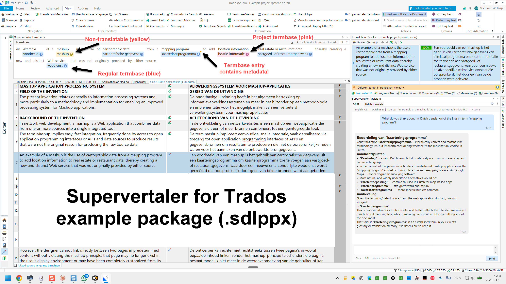
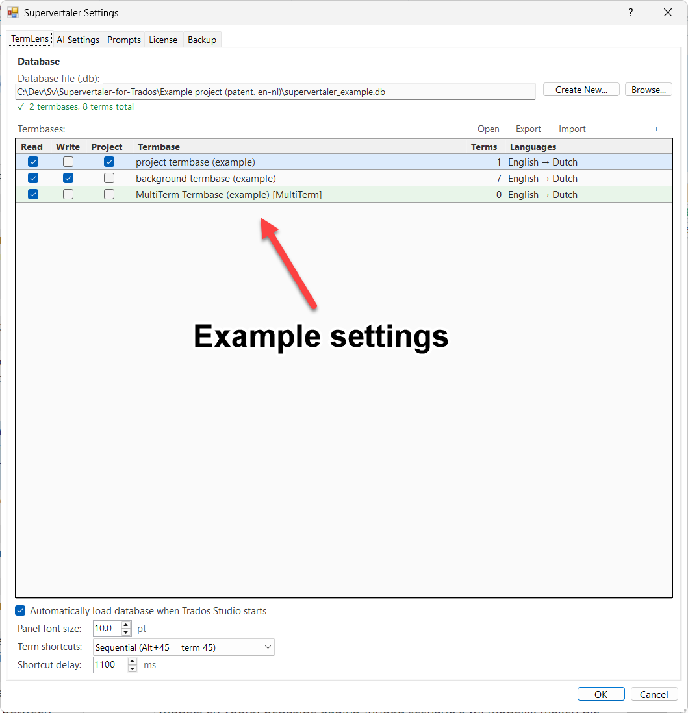

# Example Project

Supervertaler for Trados includes a downloadable example project so you can see the plugin in action without setting anything up yourself. The example is a Dutch-to-English patent translation that comes with a translation memory, a MultiTerm termbase, and a Supervertaler termbase — everything you need to see TermLens and the AI features working.

<figure><figcaption>
The example project open in Trados Studio with TermLens active.
</figcaption></figure>

## What's Included

The example package contains:

| File | Description |
|------|-------------|
| `Example project (patent, en-nl).sdlppx` | Trados Studio project package — includes the TM and MultiTerm termbase |
| `supervertaler_example.db` | Supervertaler termbase with patent terminology (Dutch → English) |
| `Example project (patent, en-nl).svproj` | Supervertaler project file |
| `Example project (patent, en-nl)_backup.tmx` | Translation memory backup in TMX format |
| `US8312383.docx` | Source document (US patent) |
| `US8312383.pdf` | Original patent PDF for reference |

## How to Use It

### 1. Download

Download the example package zip from the [latest release on GitHub](https://github.com/Supervertaler/Supervertaler-for-Trados/releases).

Look for **`Supervertaler-Example-Project.zip`** in the release assets.

### 2. Extract

Extract the zip to a folder on your computer (e.g. `C:\Supervertaler Example`).

### 3. Open the Trados Package

Double-click the `.sdlppx` file or use **File → Open Package** in Trados Studio to import the project. The translation memory and MultiTerm termbase are bundled inside the package and will be set up automatically by Trados.

### 4. Attach the Supervertaler Termbase

This is the only manual step. The Supervertaler termbase (`.db` file) is not part of the Trados package format, so you need to point the plugin to it:

1. Open the **Settings** dialog (click the gear icon in the TermLens panel header)
2. On the **TermLens** tab, click **+ Add**
3. Browse to `supervertaler_example.db` in the folder where you extracted the zip
4. Click **OK**


Don't click "New" — the example termbase already exists and is pre-populated with patent terminology. You just need to tell Supervertaler where to find it.


After attaching the termbase, your TermLens settings should look something like this:

<figure><figcaption>
Recommended TermLens settings for the example project.
</figcaption></figure>

### 5. Navigate to Segment 7

Open a file in the Editor view and go to **segment 7**. This is a good segment to start with because it has terminology matches in the Supervertaler termbase. You should see:

- **TermLens chips** appearing above the segment with matched patent terms
- **TM matches** in the Match Panel on the right
- Click any term chip (or press **Alt+1** through **Alt+9**) to insert the translation into the target

Browse through the other segments to see how TermLens highlights terminology across the document.

### 6. Try the AI Features

If you have an API key configured (see [Getting Started](getting-started.md#3.-configure-ai-ai-settings-tab)):

- Press **Ctrl+Alt+A** to AI-translate the current segment
- Open the **Supervertaler Assistant** panel to ask questions about terminology or the current segment


The example project is a real patent document, so it's a good test of how TermLens handles technical terminology in context.


---

## See Also

- [Getting Started](getting-started.md)
- [TermLens](termlens.md)
- [Batch Translate](batch-translate.md)
