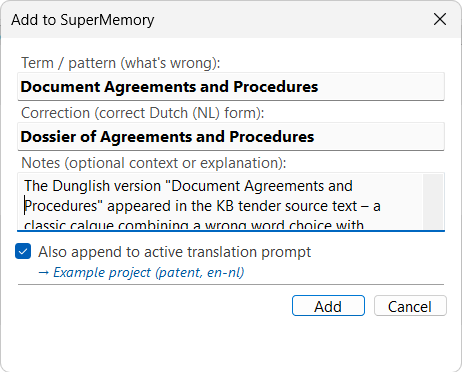

# Quick Add (Ctrl+Alt+M)

While translating in Trados, you can instantly add a term or correction to your SuperMemory vault -- and optionally inject it into your active translation prompt so the next Ctrl+T picks it up immediately.

<figure><figcaption>
The Add to SuperMemory dialogue
</figcaption></figure>

## How to use

1. In the Trados editor, select the source text you want to capture (optional -- the full source segment is used if nothing is selected)
2. Press **Ctrl+Alt+M** or right-click and choose **Add to SuperMemory**
3. Fill in the dialogue:
   * **Term / pattern (what's wrong)** -- the incorrect or ambiguous term (pre-filled from your selection)
   * **Correction** -- the correct translation (pre-filled from target selection, if any). The label adapts to your target language (e.g. "Correct Dutch form")
   * **Notes** -- optional context or explanation
   * **Also append to active translation prompt** -- when ticked, a row is added to the TERMINOLOGY table in your [active prompt](active-prompt.md) so the correction takes effect immediately
4. Click **Add**

## What happens

* A Markdown article is created in your vault's `02_TERMINOLOGY` folder with YAML frontmatter (source term, target term, domain, status, date)
* If the "append to prompt" option is ticked, a new row is inserted into the active prompt's terminology table -- the prompt is read fresh from disk on every Ctrl+T, so the change is instant


**Tip:** Quick Add is the fastest way to build up your knowledge base while translating. Spotted a Dunglish pattern? Ctrl+Alt+M, type the correction, and carry on -- your future translations automatically avoid that mistake.


## See Also

* [Active Prompt](active-prompt.md)
* [Process Inbox](process-inbox.md)
* [SuperMemory](../supermemory.md)
