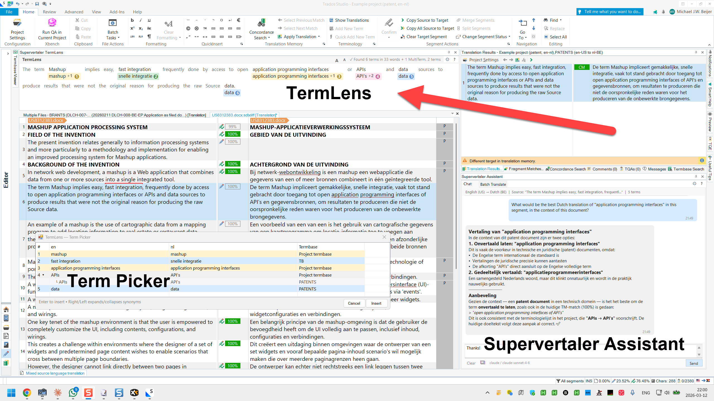


You are viewing help for **Supervertaler for Trados** — the Trados Studio plugin. Looking for help with the standalone app? Visit [Supervertaler Workbench help](https://help.supervertaler.com).


TermLens is an inline terminology display that shows the source text of the current segment word by word, with glossary translations directly underneath each matched term. It updates automatically when you navigate to a new segment.

<figure><figcaption></figcaption></figure>

## How It Works

When you select a segment in the Trados editor, TermLens analyses the source text against all active termbases and displays the result in a visual layout:

* **Matched words** appear with their glossary translation underneath, on a coloured background
* **Unmatched words** are shown in light grey text so you can read the full source sentence in context

This gives you an at-a-glance overview of every term in the segment that has a termbase entry – without hovering or clicking anything.

<figure><figcaption></figcaption></figure>

## Colour Coding

TermLens uses four background colours to distinguish term types:

| Colour     | Meaning                                  |
| ---------- | ---------------------------------------- |
| **Blue**   | Regular Supervertaler termbase match     |
| **Pink**   | Project termbase match (higher priority) |
| **Yellow** | Non-translatable term (source = target)  |
| **Green**  | MultiTerm termbase match (`.sdltb`)      |


Designate one termbase as the **Project termbase** in settings to make its terms appear in pink. Project terms take visual priority over regular terms, making it easy to spot client-specific terminology.



**MultiTerm termbases** attached to your Trados project appear automatically as green chips. They are read-only – to edit MultiTerm terms, use Trados's built-in MultiTerm interface. See [MultiTerm Support](multiterm-support.md) for details.


## Inserting Terms

### Click to Insert

Click any translation shown under a source word. The translation is inserted at the cursor position in the target field.

### Keyboard Shortcuts (Alt+1 through Alt+9)

Each matched term in TermLens is assigned a **numbered badge**. Press **Alt+1** to insert the first match, **Alt+2** for the second, and so on up to **Alt+9**.

### Shortcuts for Terms 10+

For terms numbered 10 and above, TermLens supports two shortcut styles (configurable in Settings):

* **Sequential** (default) — type the term number digit by digit: `Alt+14` inserts term 14
* **Repeated digit** — press the same digit key multiple times: `Alt+55` inserts term 14 (5th term in the second tier: 9+5)

The badge on each term chip shows exactly which key combination to use. See [Keyboard Shortcuts](keyboard-shortcuts.md) for details on both modes.


Terms beyond 45 have no keyboard shortcut. Use the **Term Picker** to insert them.


### Term Picker (Ctrl+Shift+G)

For segments with many matches, press **Ctrl+Shift+G** to open the **Term Picker** dialogue. It shows all matched terms in a searchable list and lets you insert any term with a double-click or Enter.

<figure><figcaption></figcaption></figure>

## Right-Click Context Menu

Right-click any term in TermLens to access:

| Action                       | Description                                                                        |
| ---------------------------- | ---------------------------------------------------------------------------------- |
| **Edit Term**                | Open the term editor to modify source, target, or metadata                         |
| **Delete Term**              | Remove the term from the termbase                                                  |
| **Mark as Non-Translatable** | Flag the term so it appears in yellow (source = target)                            |
| **Mark as Translatable**     | Remove the non-translatable flag (shown when the term is already non-translatable) |

## Quick-Add Terms

You can add terms without opening a dialogue:

| Shortcut       | Action                                                                    |
| -------------- | ------------------------------------------------------------------------- |
| **Alt+Down**   | Quick-add the selected text to all write termbases                        |
| **Alt+Up**     | Quick-add the selected text to the project termbase                       |
| **Ctrl+Alt+T** | Open the Add Term Entry dialog (full editor: definition, domain, notes, synonyms) |
| **Ctrl+Alt+N** | Quick-add the selected text as a non-translatable term                    |


Quick-add shortcuts use the currently selected source text and the corresponding selected or clipboard target text. The term is added instantly without opening a dialog.


## Font Size

Use the **A+** and **A-** buttons in the TermLens panel header to increase or decrease the font size. Changes apply immediately.

## Tips

* TermLens respects termbase activation –only terms from activated termbases are shown.
* If you have many termbases, designate one as the **Project termbase** (shown in pink) to make its terms stand out.
* Hover over a term to see a tooltip with all translations, synonyms, abbreviation pairs, definitions, and the termbase name.
* A small **indigo ≡ indicator** appears in the top-right corner of a term chip when the entry has synonyms. An **amber dot** appears when the entry has metadata (definition, domain, or notes). Both indicators can appear together.
* If a term has an **abbreviation** (e.g., "GC" for "gaschromatografie"), both the full term and the abbreviation are highlighted when they appear in the same segment. The abbreviation chip shows the abbreviated translation; the full-term chip shows the full translation.

***

## See Also

* [Adding & Editing Terms](termlens/adding-terms.md)
* [Term Picker](termlens/term-picker.md)
* [MultiTerm Support](multiterm-support.md)
* [Keyboard Shortcuts](keyboard-shortcuts.md)
* [Getting Started](getting-started.md)
